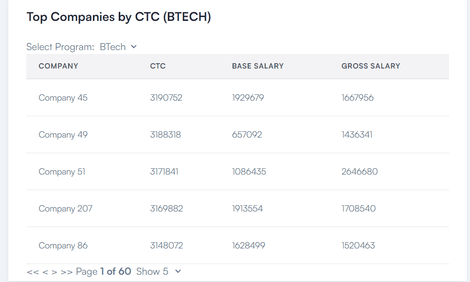
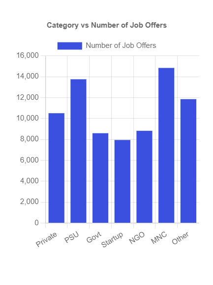

# OTP Assignment

This project is built using **React** and leverages libraries like **Chart.js**, **ApexCharts**, and **jsvectormap** to display graphs and charts dynamically. It uses **Vite** as the build tool for faster development.

## Features

- Interactive charts and graphs using **Chart.js** and **ApexCharts**.
- Custom data tables with sorting features.
- Dummy data is located in the `/public` folder for easier testing and demo purposes.
- Optimized build using **Vite** for quick previews and production builds.

## Installation

To get started, follow these instructions:

### Prerequisites

Ensure you have **Node.js** installed on your machine. You can download it from [Node.js Official Site](https://nodejs.org/).

### Steps

1. Clone the repository:

   ```bash
   git clone https://github.com/your-repo/tailadmin-react-free.git
   
2. Navigate to the project directory:
    ```bash
    cd otp-assignment
    
3. Install the dependencies using npm:
    ```bash
    npm install
4. Start the development server:
    ```bash
    npm run dev
    
## Folder Structure
The essential folders and their purposes:
- `/public` : Contains dummy data and images used in the project.
- `/src` : The main source folder for React components, hooks, and utilities.
- `/src/charts` : Components related to charts and graphs

## Preview




